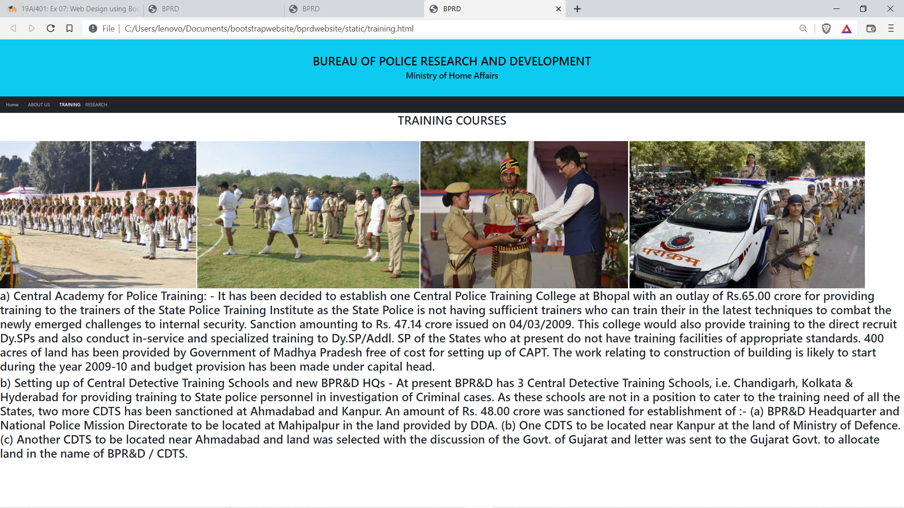

# Web Design using Bootstrap Framework

## AIM:
To design a website using bootstrap framework.

## DESIGN STEPS:

### Step 1:

Requirement collection.

### Step 2:

Creating the layout using bootstrap grid system.

### Step 3:

Updating the sample content.

### Step 4:

Choose the appropriate style and color scheme.

### Step 5:

Validate the layout in various browsers.

### Step 6:

Validate the HTML code.

### Step 6:

Publish the website in the given URL.

## PROGRAM :

~~~
HOME PAGE:
<!DOCTYPE html>
<html lang="en">
<head>
  <title>BPRD</title>
  <meta charset="utf-8">
  <meta name="viewport" content="width=device-width, initial-scale=1">
  <link href="https://cdn.jsdelivr.net/npm/bootstrap@5.1.3/dist/css/bootstrap.min.css" rel="stylesheet">
  
</head>
<body>

    <h1>BUREAU OF POLICE RESEARCH AND DEVELOPMENT</h1>
    <h3>Ministry of Home Affairs</h3> 

<nav class="navbar navbar-expand-sm bg-dark navbar-dark">
  

    <ul class="navbar-nav">
        <li class="nav-item">
            <a class="nav-link active" href="/static/home.html">Home</a>
          </li>
          <li class="nav-item">
            
          </li>
          <li class="nav-item">
            <a class="nav-link" href="/static/ABOUT US.HTML">ABOUT US</a>
          </li>
          <li class="nav-item">
            
          </li>
          <li class="nav-item">
            <a class="nav-link" href="/static/training.html">TRAINING</a>
          </li>
      
          <li class="nav-item">
            <a class="nav-link" href="/static/reseach.html">RESEARCH</a>
          </li>
          <li class="nav-item">
            
          </li> 
    </ul>
  

</nav>

  

    

      
      <h2>Director General</h2>
      <h3 class="mt-4">Links on News and Events</h3>
      
Click below

      <ul class="nav nav-pills flex-column">
        <li class="nav-item">
          <a class="nav-link active" href="https://bprd.nic.in/">BDRP</a>
        </li>
        <li class="nav-item">
          
        </li>
        <li class="nav-item">
          <a class="nav-link active" href="https://en.wikipedia.org/wiki/Bureau_of_Police_Research_and_Development">wikipedia of BDRP</a>
        </li>
        <li class="nav-item">
          
        </li>
        <li class="nav-item">
          <a class="nav-link active" href="https://twitter.com/bprdindia?lang=en">Twitter of BDRP</a>
        </li>
        <li class="nav-item">
          
        </li>
        <li class="nav-item">
          <a class="nav-link active" href="https://economictimes.indiatimes.com/topic/bureau-of-police-research-and-development">Important News</a>
        </li>
      </ul>      
      

      

      

      <h></h>
      
Refreshing for each minutes.

      

    

    

      
      <h2>What's New</h2>
      <h5>FEB 11, 2022</h5>
      
“Good Policing cannot be perceived without the BPR&D”

      
Honurable Union Home Minister and Minister of Cooperation Shri Amit Shah ji said this on the eve of the 50th anniversary of the BPR&D.

      
As we enter the 51st year, our endeavour will be to redefine policing with cutting edge research.

      
The mandate of the BPR&D has provided meaningful space for all stakeholders in policing and correctional administration. 

      
The collective wisdom of the practitioners, the academia and the civil society has culminated in inputs for policy imperatives in policing and prisons.

      
The verticals of the BPR&D on Research, Modernization, Capacity Building and the National Police Missions have contributed substantially in studying problems and defining solutions by Promoting Good Practices and Standards.

      
Sunt in culpa qui officia deserunt mollit anim id est laborum consectetur adipiscing elit, sed do eiusmod tempor incididunt ut labore et dolore magna aliqua. Ut enim ad minim veniam, quis nostrud exercitation ullamco.

    

  

  
The Bureau of Police Research and Development, was set up on 28 August 1970 in furtherance of the objective of the Government of India for the modernisation of police forces. It has evolved as a multifaceted, consultancy organisation.

</body>
</html>

ABOUT US :

<!DOCTYPE html>
<html lang="en">
<head>
  <title>BPRD</title>
  <meta charset="utf-8">
  <meta name="viewport" content="width=device-width, initial-scale=1">
  <link href="https://cdn.jsdelivr.net/npm/bootstrap@5.1.3/dist/css/bootstrap.min.css" rel="stylesheet">
  
</head>
<body>

    <h1>BUREAU OF POLICE RESEARCH AND DEVELOPMENT</h1>
    <h3>Ministry of Home Affairs</h3> 

<nav class="navbar navbar-expand-sm bg-dark navbar-dark">
  

    <ul class="navbar-nav">
        <li class="nav-item">
            <a class="nav-link " href="/static/home.html">Home</a>
          </li>
          <li class="nav-item">
            
          </li>
          <li class="nav-item">
            <a class="nav-link active" href="/static/ABOUT US.HTML">ABOUT US</a>
          </li>
          <li class="nav-item">
            
          </li>
          <li class="nav-item">
            <a class="nav-link" href="/static/training.html">TRAINING</a>
          </li>
      
          <li class="nav-item">
            <a class="nav-link" href="/static/reseach.html">RESEARCH</a>
          </li>
          <li class="nav-item">
            
          </li> 
    </ul>

  

  

            <h2 class="text-center bg-white">Evolution of BPRD</h2>
        
               <h3> CREATION:</h3>
                1. The Government of India vied Resolution No.8/136/68-P.I (Pers.I) dated 28.08.1970 formally established the Bureau of Police Research and Development (BPR&D),       
                2.    To promote a speedy and systematic study of the police problems.          
                      In addition and as a secondary, the Resolution mandated an advisory role also for the Bureau.            
                2.    Development.                
                3. Training is a vital and growing requirement to improve the competency of police forces in the country.
                4. The forensic science services uncompromising & Geese under the Development Division grew over a period and a separate Directorate of Forensic Sciences under the BPR&D came into existence in 1983. 
                5. Further in 1995 Government of India decided to entrust issues relating to Correctional Administration Work to the BPR&D so that problems relating to prisons and implementation of deemed prison reforms can be taken up by the Bureau in a cohesive manner. This set up is operating out of the existing manpower resources. 
                
                6. During the year 2008, the Government of India further decided to create National Police Mission under the administrative control of BPR&D to transform the police forces in the country into effective instrument for maintenance of internal security and facing the challenges in future, by equipping them with the necessary material, intellectual and organizational resources.  
            

            

            

 

            

            

            

            

            

            

            

            

            

            

            

            

            

            

            

            
</div

            

            

            

            

            

            

            

            

            

            

            

            

            

            

            

            

            

            

            

            

            

            

            

            

        
        
              
            
   

            

            

              
 
              

            

            

        </body>
        </html>

TRAINING PAGE:

<!DOCTYPE html>
<html lang="en">
<head>
  <title>BPRD</title>
  <meta charset="utf-8">
  <meta name="viewport" content="width=device-width, initial-scale=1">
  <link href="https://cdn.jsdelivr.net/npm/bootstrap@5.1.3/dist/css/bootstrap.min.css" rel="stylesheet">
  
</head>
<body>

    
    <h1>BUREAU OF POLICE RESEARCH AND DEVELOPMENT</h1>
    <h3>Ministry of Home Affairs</h3> 

<nav class="navbar navbar-expand-lg bg-dark navbar-dark">
  

    <ul class="navbar-nav">
        <li class="nav-item">
            <a class="nav-link" href="/static/home.html">Home</a>
          </li>
          <li class="nav-item">
            
          </li>
          <li class="nav-item">
            <a class="nav-link " href="/static/ABOUT US.HTML">ABOUT US</a>
          </li>
          <li class="nav-item">
            
          </li>
          <li class="nav-item">
            <a class="nav-link active" href="/static/training.html">TRAINING</a>
          </li>
      
          <li class="nav-item">
            <a class="nav-link" href="/static/reseach.html">RESEARCH</a>
          </li>
          <li class="nav-item">
            
          </li> 
    </ul>
  

</nav>

    <h1 class="text-center bg-white">TRAINING COURSES</h1>

    

       
    

    

 

 
<h1>a) Central Academy for Police Training: -
    It has been decided to establish one Central Police Training College at
   Bhopal with an outlay of Rs.65.00 crore for providing training to the trainers of
   the State Police Training Institute as the State Police is not having sufficient
   trainers who can train their in the latest techniques to combat the newly
   emerged challenges to internal security. Sanction amounting to Rs. 47.14 crore
   issued on 04/03/2009. This college would also provide training to the direct
   recruit Dy.SPs and also conduct in-service and specialized training to
   Dy.SP/Addl. SP of the States who at present do not have training facilities of
   appropriate standards. 400 acres of land has been provided by Government of
   Madhya Pradesh free of cost for setting up of CAPT. The work relating to
   construction of building is likely to start during the year 2009-10 and budget
   provision has been made under capital head. </h1>

   

    
   

   
<h1>b) Setting up of Central Detective Training Schools and new BPR&D
    HQs -
     At present BPR&D has 3 Central Detective Training Schools, i.e.
    Chandigarh, Kolkata & Hyderabad for providing training to State police
    personnel in investigation of Criminal cases. As these schools are not in a
    position to cater to the training need of all the States, two more CDTS has been
    sanctioned at Ahmadabad and Kanpur.
    An amount of Rs. 48.00 crore was sanctioned for establishment of :-
     (a) BPR&D Headquarter and National Police Mission Directorate to be
    located at Mahipalpur in the land provided by DDA.
    (b) One CDTS to be located near Kanpur at the land of Ministry of Defence.
    (c) Another CDTS to be located near Ahmadabad and land was selected with
    the discussion of the Govt. of Gujarat and letter was sent to the Gujarat
    Govt. to allocate land in the name of BPR&D / CDTS. </h1>

 
~~~

## OUTPUT:
### Home Page:

### ABOUT US PAGE:

### TRAINING PAGE:

## Result:
 
 Thus the webpages are created using Bootstrap ,CSS and html.
